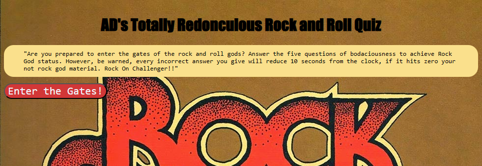

# AD-s-Totally-Redonculous-Rock-and-Roll-Quiz

## Description

This is the initial version of AD's Totally Redonculous rock and roll quiz submitted by "AD" for Penn Full Stack Web Development. The initial quiz is meant to display what has been leard about js and its implementation in styling html in tandem with css. The quiz cycles through 5 questions with 4 potential answers to each question.
## Installation

N/A

## Usage

To navigate the quiz, the user can click on the "enter the gates" button to navigate to the questions and thier potential answers. When all questions have been entered the user can input thier innitials and look at past high scores.

.png

## Credits
http://2.bp.blogspot.com/-ftFwEk9eA9s/VKG-yEOhWSI/AAAAAAAAGlA/cyXjuIF8CXQ/s1600/The%2BHellacopters%2B-%2BRock%2B%26%2BRoll%2BIs%2BDead.jpg

w3 schools
## License

MIT License